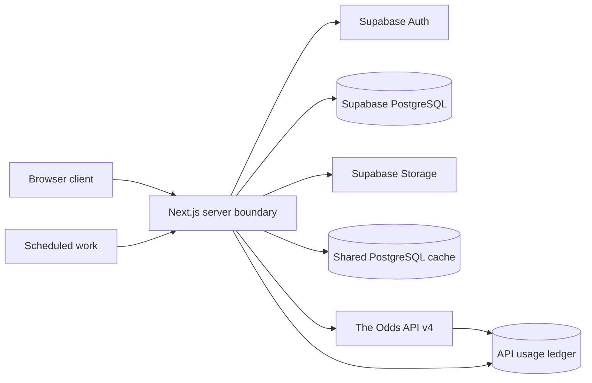

# The Units Lab Architecture

## Purpose and status

This document turns the governing product specification into architectural boundaries and records the technical foundation selected during Phase 0. Phases 0–8 are implemented; Phase 8 changes presentation and release-readiness surfaces only. Product questions left open by the source remain open unless an explicit owner clarification is recorded.

The system must support multiple authenticated users and private groups, server-side odds ingestion, virtual-unit wagering, external-wager tracking, secure screenshots, deterministic settlement, analytics, leaderboards, and quota-aware operation without real-money wagering.

## Confirmed architectural constraints

- Real-money wagering is outside the system boundary. The application does not accept money, connect users to sportsbook execution, transfer bankroll between users, or provide monetary prizes.
- Simulated and external wagers have different effects. Only simulated wagers affect the virtual-bankroll ledger.
- The Odds API key, Supabase service-role credentials, and privileged operations stay server-side.
- Submitted wager terms are immutable snapshots.
- Settlement and bankroll crediting are deterministic, auditable, and idempotent.
- A shared server-side cache prevents one upstream odds request per viewer.
- API quota response data is recorded in an internal usage ledger and drives conservation behavior.
- Supabase Row Level Security protects every exposed application table; direct access is part of authorization testing.
- Screenshots use secure object storage and honor user and group privacy.
- Sports, competitions, and bookmakers are configurable.
- Database state is reproducible from repository migrations.
- The service must target $0 monthly operation, and a paid dependency requires explicit approval.

## Source proposed platform

The governing source proposes, but does not fully select:

- Next.js with TypeScript for the application.
- Supabase PostgreSQL, Auth, Storage, and Row Level Security.
- The Odds API v4 for initial odds and score data.
- Vercel or an equivalent zero-cost host.
- GitHub for source control.

Phase 0 selects Node.js 24.18.1, npm 11.16.0, Next.js 16.3.5, React 19.3.0, TypeScript 6.0.3, Supabase CLI 2.117.0, Vitest 5, ESLint 9.39.5, and Prettier 3. TypeScript 6 and ESLint 9 are selected because the current Next.js lint stack does not yet support TypeScript 7 or ESLint 10. Vercel Hobby is the zero-cost deployment baseline for a private, non-commercial project. These are reversible technical selections, not new product rules. Authentication method remains an owner decision for Phase 1.

Phase 1 adds `@supabase/ssr` 0.12.7 and `@supabase/supabase-js` 2.116.0 and selects email-and-password authentication. App Router Server Components and Server Actions use request-scoped cookie clients, while the root Next.js proxy refreshes sessions. The browser receives only the public Supabase URL and public anonymous or publishable key.

## Phase 0 component boundaries

The browser receives only explicitly public Supabase configuration and provider-independent data. Provider keys, service-role credentials, cache writes, quota accounting, and privileged operations stay in server-only modules. A PostgreSQL-backed shared cache is selected for the initial implementation because it is consistent across application instances, uses the already-selected free Supabase tier, and avoids another vendor. Phase 2 owns its tables and behavior.

Vercel Hobby scheduled jobs run at most daily and with imprecise timing, so they cannot provide useful live-score polling. Phase 0 therefore does not assume Vercel Cron can settle games promptly. Phase 2 and Phase 4 must choose a zero-cost, bounded scheduling mechanism or document the cost blocker before implementing polling.

## System boundaries

The intended logical flow is:

1. A browser client renders sportsbook, bet, tracking, performance, group, and settings experiences.
2. Server-side application code authenticates requests, enforces business rules, owns provider calls, constructs immutable ticket snapshots, coordinates settlement, and performs privileged administration.
3. Supabase Auth establishes identity.
4. PostgreSQL stores application profiles, group membership, wagers, bankroll entries, settlement audits, normalized provider data, and API usage records.
5. Row Level Security restricts exposed data by user and group membership.
6. Supabase Storage holds external-wager screenshots behind access controls.
7. A shared cache sits between application reads and The Odds API so equivalent requests reuse data.
8. Background or scheduled work fetches useful scores and settles eligible wagers without uncontrolled polling.

Phase 0 selects a PostgreSQL-backed shared cache as a reversible technical choice. It will keep replaceable provider responses separate from durable ticket snapshots and use canonical request keys plus expiry timestamps. Request coalescing, stale-on-error behavior, and exact refresh permissions remain Phase 2 decisions.

## Domain boundaries

### Identity and profiles

Supabase Auth owns credentials. A separate application profile holds non-authentication data such as display name, avatar, created date, optional unit-size description, default bankroll, time zone, and privacy settings. Email addresses must not be exposed to other users.

Phase 1 implements `public.profiles` one-to-one with `auth.users`. A signup trigger creates the application profile from validated display-name metadata, and the migration backfills any pre-existing authentication identities without copying email. Users may read and update their own profile. A profile marked `group_members` is also readable by shared-group members; a private profile is self-only. Identity and creation timestamps are immutable.

### Groups and authorization

Private groups and group membership define social visibility. The source recommends groups and group_members, with owner, admin, and member roles. A join entity is the safest interpretation of the requirement that users may eventually belong to multiple groups, but the initial user-facing cardinality and role permissions require approval.

Phase 1 implements `public.groups`, `public.group_members`, and `public.group_invites`. Membership is many-to-many. Group creation automatically creates one owner membership. The owner is immutable during Phase 1; owners control other users' roles, owners and admins create or revoke invites, owners may remove non-owners, admins may remove members, and non-owners may leave.

Invite bearer tokens are random, expiring, and limited-use. The plaintext token is returned once and only a SHA-256 hash is stored. Membership joins, role changes, invite creation or revocation, and removals run through narrow security-definer functions. Authenticated users receive no direct write grant on membership or invitation tables.

### Sports provider data

Provider-specific events, markets, outcomes, bookmaker identifiers, odds, scores, timestamps, and quota headers should be normalized behind an internal model. The submitted ticket keeps its own immutable copy of the terms required to reconstruct it; historical tickets do not depend on mutable cached odds.

### Simulated wagering

A ticket has one or more legs, a stake in virtual units, calculated odds and returns, status, and settlement state. The source recommends bets and bet_legs entities and lists their candidate fields in the product specification. The owner clarified on 2026-09-11 that Phase 3 and Phase 4 support straight wagers only; multi-leg parlay behavior begins in Phase 7.

Phase 3 physically implements `public.bets` and `public.bet_legs`. Phase 7 extends the same tables: `bets.ticket_type` distinguishes straight/parlay and `leg_count` is constrained to one for straight tickets or two through twelve for parlays. A simulated parlay is accepted only when every leg is fresh and authoritative, uses one bookmaker, and references a distinct provider event; same-event and cross-book combinations are rejected because no verified correlation pricing exists. One parent ticket, immutable leg snapshots, one stake debit, and the initial bankroll check commit atomically. Ticket history never joins current cache data for reconstruction.

The authenticated placement function accepts selection identifiers, the requested stake, an optional group ID, and the line and price displayed to the user. It derives identity from `auth.uid()`, resolves all authoritative terms from a non-expired shared cache row, rejects a started event or unsupported selection, and emits an explicit odds-changed failure rather than silently accepting a new price. If supplied, group membership is verified inside the same function.

### Virtual bankroll

The ledger is the source of truth. Current balance is derived from ledger transactions rather than trusted as an independently mutable value.

Phase 3 implements `public.bankroll_ledger` as append-only exact `numeric(14,2)` movements. Existing profiles are backfilled once, future profile creation triggers one 10,000-unit allocation, and a partial unique index plus idempotency key prevents duplicate allocation under retries or races. Placement takes a transaction-scoped advisory lock derived from the authenticated user ID, sums ledger entries while serialized, rejects insufficient funds, and inserts the ticket, leg, and negative stake entry in one PostgreSQL transaction. There is no independently mutable balance column.

### External wagering

External records capture unit-normalized results for wagers placed elsewhere. They remain identifiable as IRL or external in storage and analytics and never touch the simulated ledger. Optional screenshots are evidence or reference, not a V1 parsing dependency.

### Phase 5 external wagering implementation

Phase 5 implements external wagers in `public.external_wagers`, physically separate from simulated `bets` and `bet_legs`. Phase 7 adds `ticket_type`, `leg_count`, effective settlement economics, and normalized `external_wager_legs`; parent rows retain the legacy first-leg sport/competition fields for compatibility while analytics derives mixed dimensions from all legs. The row stores the immutable sportsbook, sport, competition, event, selection, market, line, American and calculated decimal odds, unit stake, wager date, optional group, verification state, and notes. Its fixed `source = external` constraint makes source filtering explicit. Result, calculated profit/loss, settlement time, update time, per-leg result state, and the one-time screenshot reference are the only mutable fields, and ordinary clients receive no direct write grant.

Authenticated creation and result functions derive the caller from `auth.uid()`. Creation validates current group membership and read-only catalog entries. Result entry locks a caller-owned row and calculates win, loss, push, or void units from the stored stake and odds. Every result change appends before/after evidence to `external_wager_result_audits`. Neither function contains a bankroll insert or accepts a profit/loss parameter; the external table cannot satisfy the foreign key used by `bankroll_ledger.bet_id`.

The private `external-wager-screenshots` bucket accepts JPEG, PNG, and WebP objects up to 5 MiB. Object names are generated as `<owner>/<external-wager>/<random filename>`. Storage insert policy requires the authenticated owner namespace and an existing caller-owned wager. Select policy requires an attached wager plus owner or current-group-member visibility. Attachment is one-time, verifies the object owner and matching path, and stores only the private object name. The application issues a 60-second signed URL after the same RLS-protected lookup; it never stores a public URL or parses image content.

The Phase 5 summary is personal and external-only. Settled count includes won, lost, push, and void. Units wagered and ROI exclude void stakes; net units is the sum of database-calculated profit/loss; ROI is net units divided by non-void settled stake. Phase 6 owns combined analytics, detailed breakdowns, and leaderboards.

### Settlement

The settlement engine consumes final event results and immutable ticket terms, computes leg and ticket results, writes audit data, and applies any bankroll credit once. Reprocessing the same final result must produce no duplicate credit.

### Analytics and leaderboards

Phase 6/7 implements `app_private.analytics_wager_rows` as the canonical `union all` projection over simulated ticket parents and current external-wager parents. Each parlay contributes exactly one row; leg stake is never duplicated. Sport and competition are the leg value when uniform, otherwise the deterministic `mixed` classification. The projection retains source, straight/parlay type, dimensions, accepted economics, canonical wager time, and current authoritative result without joining correction or settlement audit rows. Simulated profit/loss is derived from immutable stored ticket economics; external profit/loss uses the current database-calculated value.

The public personal RPC has no user parameter and derives its owner from `auth.uid()`. Group wager and member RPCs require current membership inside fixed-search-path security-definer functions before exposing cross-user performance. They disclose no email/authentication data and respect private profile display-name visibility. The private canonical projection is not executable by browser roles.

Exact TypeScript aggregation parses two-place unit values and four-place accepted decimal odds into integers. It centrally calculates counts, non-void settled stake, net units, ROI, win rate, average odds, streaks, breakdowns, source/time filters, minimum eligibility, and deterministic dense ranking. Request-time derivation avoids mutable-counter drift and needs no provider request or materialized analytics service. Full conventions are recorded in `docs/PHASE_6_PLAN.md`.

### Phase 8 presentation and release boundary

The signed-in root route is the dashboard. It composes the existing personal analytics RPC, the
append-only bankroll ledger, own simulated ticket rows, and private group rows; it does not create a
second analytics calculation or call the provider. Signed-in destinations share one navigation
component with active-location semantics. The Admin destination is rendered only for the existing
server-side allowlist, and the admin page retains its independent authorization check.

Reusable status, source, ticket-type, and market badges make `Simulated` versus `IRL / external`,
straight versus parlay, and open/won/lost/push/void states explicit in text as well as color. Next.js
loading, error, global-error, and not-found boundaries provide safe fallbacks. Native labels,
server-action pending affordances, visible focus rings, captions, responsive data regions, and
reduced-motion support are presentation concerns only; server-authoritative placement, settlement,
RLS, screenshot access, and analytics rules are unchanged.

### Administration and operations

Administrative capabilities include quota inspection, request history, settlement-failure inspection, safe settlement reruns, bankroll adjustments, group membership management, upload moderation, and competition or bookmaker toggles. The source does not define the boundary between group administration and application administration.

## Data model direction

### Confirmed concepts

- Separate authentication records and application profiles.
- Private groups with membership and roles.
- A source classification on every wager.
- Tickets and legs capable of preserving exact submitted terms.
- A virtual-bankroll ledger.
- External wagers with optional screenshots and verification status.
- Settlement audit information.
- Normalized events, odds, and retained provider event identifiers.
- API-usage ledger and configurable sports, competitions, and bookmakers.

### Source recommended entities and fields

The source explicitly recommends bets and bet_legs with the fields listed in docs/PRODUCT_SPEC.md, and identifies groups and group_members as core entities. These names are useful starting points but are not a finalized physical schema.

### Reasonable technical recommendations pending approval

- Model profiles as a one-to-one application record keyed to Supabase Auth identity.
- Model group membership as many-to-many from the first migration even if V1 initially exposes one active group.
- Separate the immutable ticket snapshot from mutable live display and settlement data, either through snapshot columns or a versioned JSON payload with validated typed fields.
- Give each settlement application and ledger transaction a database-enforced idempotency key or uniqueness constraint.
- Keep provider keys separate from internal sport, competition, event, market, and bookmaker identifiers.
- Store monetary-style quantities as fixed-precision numeric values, never binary floating point. Precision and rounding rules still require a product decision.
- Treat cached provider data as replaceable operational data and wager, ledger, audit, and external-tracking records as durable system-of-record data.
- Create a conceptual full-domain ERD in Phase 0 and an implementation-ready Phase 1 schema subset, so later phases are accommodated without prematurely migrating unused tables.

These are technical recommendations, not new product rules.

## Security architecture

Authorization has three layers:

1. The application authenticates users and validates requests.
2. Row Level Security enforces ownership and group visibility at the database boundary.
3. Server-only privileged code uses service credentials only for narrowly defined administrative or background operations.

Tests must attempt unauthorized direct reads and writes, not only exercise visible UI paths. Storage policies must align screenshot access with the corresponding wager and group visibility. Service-role and provider secrets must never enter client bundles or public logs.

Phase 1 policies use current-user membership helpers in the unexposed `app_private` schema to avoid recursive Row Level Security evaluation. All four Phase 1 tables enable and force RLS. Anonymous roles have no table access. The authenticated role receives only the table and function privileges required for profile, group, and invitation workflows. A pgTAP suite changes JWT claims among synthetic users and exercises the database boundary directly.

The source does not define role permissions, data retention, backup, recovery, rate limiting, content scanning, or legal and age controls. Those are unresolved rather than assumed.

## Provider caching and quota architecture

Phase 1 does not implement provider access. Phase 2 must preserve application-scoped shared caching, configurable freshness timestamps, concurrent-miss deduplication or locking, and usage-ledger entries for actual upstream calls rather than per-user reads.

### Phase 2 implementation

Phase 2 implements this boundary with `public.odds_cache`, a replaceable normalized JSON dataset keyed by a SHA-256 hash of canonical provider, endpoint, competition, market, bookmaker, region, and format parameters. Authenticated users may read this intentionally shared data through RLS but cannot write it. Server-only service code performs provider calls and cache writes.

Cross-instance cache stampedes are prevented by an atomic short lease stored in `app_private.odds_refresh_leases`; narrow public-schema RPC functions are executable only by `service_role`. A lease loser rechecks the shared cache and never independently calls the provider while the winner is refreshing. Pregame TTL is 15 minutes, the manual-refresh floor is five minutes, and Conserve lengthens automatic freshness to 30 minutes. High serves stale data rather than spending nonessential quota; Critical allows only explicit stale manual refreshes. Provider failures return visibly stale data when available.

`public.api_usage_ledger` records one row per successful upstream response and no row for cache reads. The allowlisted administrative dashboard reads it through server-only credentials. No background polling or Phase 4 score behavior exists.

The provider integration should have a single server-side client boundary responsible for:

- Forming and identifying equivalent upstream requests.
- Reading and writing shared cached responses.
- Recording request purpose and sport or competition context.
- Capturing quota used, remaining, and latest-request cost where the provider supplies them.
- Applying configured conservation thresholds.
- Preventing uncontrolled request and score-polling loops.
- Returning provider-independent internal event and market data.

Pregame odds have a recommended 10–15-minute cache window. Schedule caching, stale-on-error behavior, refresh permissions, request coalescing, and the precise threshold policy remain decisions. Active wagers, actively viewed games, final results, and user-requested refreshes receive priority as quotas tighten.

## Reliability and data integrity

- Treat bet submission as one logical operation that validates stake and terms, persists the immutable ticket, and records the stake ledger entry consistently.
- Treat settlement as one logical operation that records the result, audit evidence, and any return ledger entry exactly once.
- Preserve raw provider identifiers and useful response metadata needed to investigate grading.
- Keep calculations pure and deterministic where possible so odds conversion, payouts, grading, and parlay rules can be unit tested.
- Keep database migrations ordered and reproducible.
- Record and verify provider-behavior assumptions rather than hiding them in code.

Phase 3 resolves its transaction and precision subset: unit quantities use two decimal places, accepted decimal odds use four, potential profit rounds to hundredths with exact decimal arithmetic, and PostgreSQL function execution is the atomic boundary. Bet placement never triggers an upstream provider request; an expired cache requires refresh and review before submission.

### Phase 4 score and settlement architecture

`public.event_scores` is the provider-independent shared score model keyed by the exact `provider_event_id` retained in each immutable Phase 3 leg. It records configured competition and sport, teams, scheduled start, normalized scheduled/live/final state, score pair, optional provider status fields, provider update time, and application refresh time. Authenticated users may read it; only service-role code can call the score writer. A final record is protected from automatic replacement until an explicit correction policy exists.

`public.score_refresh_state` and the existing cross-instance refresh leases coalesce score endpoint misses by canonical competition request. Pregame/unknown results use a 15-minute normal TTL, live results a 60-second normal TTL, and all-final responses a 24-hour TTL. Conserve lengthens refreshes, High blocks active-view calls while retaining open-wager and settlement work, and Critical permits settlement-purpose calls only. Every actual upstream score response creates one `api_usage_ledger` row; cache hits create none.

Settlement uses `public.settle_simulated_straight_bet` for legacy tickets and `public.settle_simulated_parlay_bet` for parlays. Both lock the ticket row, require exact provider-event/competition/team association to durable finals, grade from immutable terms, append any return exactly once, change ticket status, and append audit evidence in one transaction. Parlay settlement waits for every non-void leg to have a durable final; any loss is decisive, all active legs must win for a win, pushes/voids contribute a neutral 1.0000 price, all-void is `void`, and a push/void-only mixture is `push`. Effective odds and final economics are persisted separately from original potential economics. The shared `settlement:<bet_id>` key and ledger uniqueness constraints permit at most one economic credit per ticket. Retries and concurrent callers wait on the same ticket lock and become audited `already_settled` attempts.

Wins credit the immutable stored potential return, losses credit nothing, pushes refund the immutable stake, and documented operator-confirmed voids refund the immutable stake. Provider cancellation semantics are not inferred. `settlement_audits` is append-only and owner-readable; failures preserve association evidence without changing the ticket.

The authenticated `POST /api/settlement` route is a bounded serverless job surface protected by `CRON_SECRET`. It derives competitions from open wagers, performs shared settlement-priority refreshes, then safely retries the database batch. The My Bets action performs the same cache-aware flow for the current user's actively viewed open competitions. Neither creates a permanent polling process.

The final-score correction workflow and production schedule frequency remain unresolved. The settlement transaction, retry behavior, cache policy, and safe invocation boundary are implemented in Phase 4.

## Testing strategy required by the source

Testing must cover:

- American odds conversion and payout calculations.
- Pushes, soccer draws, spread and total grading.
- Parlay payouts and win, loss, push, and void combinations.
- Settlement idempotency and duplicate-credit prevention.
- Row Level Security and direct authorization boundaries.
- Reconciliation of analytics and leaderboards to underlying wagers.

A Phase 0 recommendation is to divide tests into pure calculation tests, database and RLS integration tests, provider-contract fixtures, and end-to-end vertical-flow tests. Tool selection is unresolved.

## Cost and portability

Free tiers are operating constraints, not an afterthought. Phase 0 must document current free allowances and expected usage without introducing a paid assumption. If a later phase cannot fit, work stops for an explicit cost decision.

Provider and platform access should be isolated behind narrow interfaces so The Odds API, hosting, storage, scheduling, or caching can be replaced without rewriting core wager and settlement rules.

## Architectural gates by phase

- Phase 0: the design supports multiple users and groups.
- Phase 1: direct tests prove users cannot alter another user's private records or read unauthorized groups.
- Phase 2: supported odds display without unnecessary upstream calls.
- Phase 3: a straight ticket persists and reconstructs exactly as submitted.
- Phase 4: supported straight wagers settle without duplicate payouts.
- Phase 5: an external wager settles without changing the virtual bankroll.
- Phase 6: leaderboard totals reconcile with wagers.
- Phase 7: parlay placement, result combinations, adjusted payouts, external corrections, and concurrency pass automated tests.
- Phase 8: the primary flows have coherent navigation, deliberate UI states, responsive/mobile and keyboard review evidence, and release-readiness documentation without changing the domain or provider boundaries.

## Unresolved architecture decisions

The decisions listed in docs/PRODUCT_SPEC.md remain open. The most architecture-sensitive are:

- Parlays are implemented in Phase 7 by extending the Phase 3/4 ticket, leg, settlement, and ledger boundaries; no duplicate bankroll or analytics subsystem exists.
- Application-wide invite-only account admission and possible later magic-link authentication. Phase 1 uses email and password plus private-group invitations.
- Ownership transfer and application-admin identity. Phase 1 supports multiple groups and defines group roles in Decision 0002.
- Settlement correction and Phase 4+ concurrency policies. Phase 3 placement precision, rounding, and per-user locking are implemented and documented.
- Shared-cache implementation and background scheduling on a zero-cost host.
- Exact provider score capabilities, quota costs, configuration keys, and unavailable-market behavior.
- Screenshot retention, deletion, and moderation. Phase 5 resolves owner/current-group-member access and private object storage only.
- Analytics definitions, time boundaries, and minimum samples.
- Hosting, versions, package manager, test stack, deployment workflow, and observability.
- Live-provider validation with production credentials and a confirmed zero-cost production score/settlement schedule remain pre-production items; Phase 8 does not claim either has been solved.
