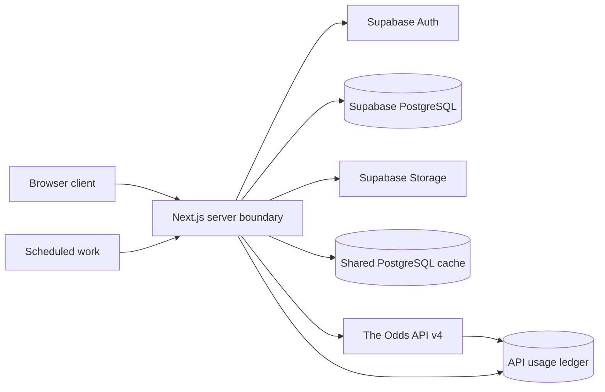

# The Units Lab Architecture

## Purpose and status

This document turns the governing product specification into architectural boundaries and records the technical foundation selected during Phase 0. Phases 0–8 are implemented; v0.11.0 added private-beta release-readiness surfaces, v0.12.0 launched the private beta, v0.12.1 added the authentication onboarding hotfix, v0.13.0 added hashed group invite codes, and v0.14.0 adds an Odds Watchlist with shared movement history and moves imported-wager manual settlement into My Bets. Product questions left open by the source remain open unless an explicit owner clarification is recorded.

The system must support multiple authenticated users and private groups, server-side odds ingestion, virtual-unit wagering, external-wager tracking, secure screenshots, deterministic settlement, analytics, leaderboards, and quota-aware operation without real-money wagering.

## Confirmed architectural constraints

- Real-money wagering is outside the system boundary. The application does not accept money, connect users to sportsbook execution, transfer bankroll between users, or provide monetary prizes.
- Simulated and external wagers have different effects. Only simulated wagers affect the virtual-bankroll ledger.
- The Odds API key, Supabase service-role credentials, and privileged operations stay server-side.
- Submitted wager terms are immutable snapshots.
- Settlement and bankroll crediting are deterministic, auditable, and idempotent.
- A shared server-side cache prevents one upstream odds request per viewer.
- API quota response data is recorded in an internal usage ledger and drives conservation behavior.
- Supabase Row Level Security protects every exposed application table; direct access is part of authorization testing.
- Screenshots use secure object storage and honor user and group privacy.
- Sports, competitions, and bookmakers are configurable.
- Database state is reproducible from repository migrations.
- The service must target $0 monthly operation, and a paid dependency requires explicit approval.

## Source proposed platform

The governing source proposes, but does not fully select:

- Next.js with TypeScript for the application.
- Supabase PostgreSQL, Auth, Storage, and Row Level Security.
- The Odds API v4 for initial odds and score data.
- Vercel or an equivalent zero-cost host.
- GitHub for source control.

Phase 0 selects Node.js 24.18.1, npm 11.16.0, Next.js 16.3.5, React 19.3.0, TypeScript 6.0.3, Supabase CLI 2.117.0, Vitest 5, ESLint 9.39.5, and Prettier 3. TypeScript 6 and ESLint 9 are selected because the current Next.js lint stack does not yet support TypeScript 7 or ESLint 10. Vercel Hobby is the zero-cost deployment baseline for a private, non-commercial project. These are reversible technical selections, not new product rules. Authentication method remains an owner decision for Phase 1.

Phase 1 adds `@supabase/ssr` 0.12.7 and `@supabase/supabase-js` 2.116.0 and selects email-and-password authentication. App Router Server Components and Server Actions use request-scoped cookie clients, while the root Next.js proxy refreshes sessions. The browser receives only the public Supabase URL and public anonymous or publishable key. The v0.12.1 authentication hotfix uses the server client's default PKCE flow: signup and recovery request explicit callback URLs, `/auth/callback` exchanges the authorization code with `exchangeCodeForSession`, and the resulting cookie session is consumed by the confirmation or password-update page. No token is decoded in browser code.

## Phase 0 component boundaries

The browser receives only explicitly public Supabase configuration and provider-independent data. Provider keys, service-role credentials, cache writes, quota accounting, and privileged operations stay in server-only modules. A PostgreSQL-backed shared cache is selected for the initial implementation because it is consistent across application instances, uses the already-selected free Supabase tier, and avoids another vendor. Phase 2 owns its tables and behavior.

Vercel Hobby scheduled jobs run at most daily and with imprecise timing, so they cannot provide useful live-score polling. Phase 0 therefore does not assume Vercel Cron can settle games promptly. Phase 2 and Phase 4 must choose a zero-cost, bounded scheduling mechanism or document the cost blocker before implementing polling.

## System boundaries

The intended logical flow is:

1. A browser client renders sportsbook, bet, tracking, performance, group, and settings experiences.
2. Server-side application code authenticates requests, enforces business rules, owns provider calls, constructs immutable ticket snapshots, coordinates settlement, and performs privileged administration.
3. Supabase Auth establishes identity.
4. PostgreSQL stores application profiles, group membership, wagers, bankroll entries, settlement audits, normalized provider data, and API usage records.
5. Row Level Security restricts exposed data by user and group membership.
6. Supabase Storage holds external-wager screenshots behind access controls.
7. A shared cache sits between application reads and The Odds API so equivalent requests reuse data.
8. Background or scheduled work fetches useful scores and settles eligible wagers without uncontrolled polling.

Phase 0 selects a PostgreSQL-backed shared cache as a reversible technical choice. It will keep replaceable provider responses separate from durable ticket snapshots and use canonical request keys plus expiry timestamps. Request coalescing, stale-on-error behavior, and exact refresh permissions remain Phase 2 decisions.

## Domain boundaries

### Identity and profiles

Supabase Auth owns credentials. A separate application profile holds non-authentication data such as display name, avatar, created date, optional unit-size description, default bankroll, time zone, and privacy settings. Email addresses must not be exposed to other users.

Phase 1 implements `public.profiles` one-to-one with `auth.users`. A signup trigger creates the application profile from validated display-name metadata, and the migration backfills any pre-existing authentication identities without copying email. Users may read and update their own profile. A profile marked `group_members` is also readable by shared-group members; a private profile is self-only. Identity and creation timestamps are immutable. Profile creation remains safely cascade-deletable for an abandoned, unconfirmed signup.

### Authentication onboarding and recovery

The signup action preserves the existing server-side profile-trigger path and supplies
`/auth/callback?next=%2Fauth%2Fconfirmed` as `emailRedirectTo`. A successful signup without a
session sends the user to the dedicated Check your email page. Supabase's confirmation link returns
to the callback with a one-time PKCE code; the route exchanges it using the request-scoped SSR
client, persists the session cookie, and shows an explicit Email confirmed state. Callback errors
are reduced to safe expired, invalid, already-used, missing, or exchange-failed states.

Password recovery uses `resetPasswordForEmail` with
`/auth/callback?next=%2Fauth%2Frecovery`. The same server-side code exchange establishes the recovery
session before the recovery page renders. `updateUser({ password })` is called only after
`getUser()` confirms that session; password values never enter URLs or logs. The privacy-safe reset
response is identical for unknown addresses and provider failures. `APP_URL` is the production
origin configuration, with localhost fallback only for local development. The callback and the root
application layout both run the caller-derived authenticated bootstrap; the layout is the fallback when
a browser closes during the callback or the callback page is not revisited. The bootstrap calls
`public.ensure_initial_bankroll()` without a client-supplied user ID.

### Groups and authorization

Private groups and group membership define social visibility. The source recommends groups and group_members, with owner, admin, and member roles. A join entity is the safest interpretation of the requirement that users may eventually belong to multiple groups, but the initial user-facing cardinality and role permissions require approval.

Phase 1 implements `public.groups`, `public.group_members`, and `public.group_invites`. Membership is many-to-many. Group creation automatically creates one owner membership. The owner is immutable during Phase 1; owners control other users' roles, owners and admins create or revoke invites, owners may remove non-owners, admins may remove members, and non-owners may leave.

Invite bearer tokens are random, expiring, and limited-use. The plaintext token is returned once and only a SHA-256 hash is stored. v0.13.0 adds an optional SHA-256 hash for an eight-character, ambiguous-character-avoiding code; legacy link-only rows remain valid. Link and code wrappers call one locked private redemption function, which handles membership insertion and use counting atomically. Authenticated code attempts are throttled in the unexposed database schema without a paid service. Membership joins, role changes, invite creation or revocation, and removals run through narrow security-definer functions. Authenticated users receive no direct write grant on membership or invitation tables.

### Sports provider data

Provider-specific events, markets, outcomes, bookmaker identifiers, odds, scores, timestamps, and quota headers should be normalized behind an internal model. The submitted ticket keeps its own immutable copy of the terms required to reconstruct it; historical tickets do not depend on mutable cached odds.

### Simulated wagering

A ticket has one or more legs, a stake in virtual units, calculated odds and returns, status, and settlement state. The source recommends bets and bet_legs entities and lists their candidate fields in the product specification. The owner clarified on 2026-09-11 that Phase 3 and Phase 4 support straight wagers only; multi-leg parlay behavior begins in Phase 7.

Phase 3 physically implements `public.bets` and `public.bet_legs`. Phase 7 extends the same tables: `bets.ticket_type` distinguishes straight/parlay and `leg_count` is constrained to one for straight tickets or two through twelve for parlays. A simulated parlay is accepted only when every leg is fresh and authoritative, uses one bookmaker, and references a distinct provider event; same-event and cross-book combinations are rejected because no verified correlation pricing exists. One parent ticket, immutable leg snapshots, one stake debit, and the initial bankroll check commit atomically. Ticket history never joins current cache data for reconstruction.

The authenticated placement function accepts selection identifiers, the requested stake, an optional group ID, and the line and price displayed to the user. It derives identity from `auth.uid()`, resolves all authoritative terms from a non-expired shared cache row, rejects a started event or unsupported selection, and emits an explicit odds-changed failure rather than silently accepting a new price. If supplied, group membership is verified inside the same function.

### Virtual bankroll

The ledger is the source of truth. Current balance is derived from ledger transactions rather than trusted as an independently mutable value.

Phase 3 implements `public.bankroll_ledger` as append-only exact `numeric(14,2)` movements. Existing profiles were backfilled once, and `public.ensure_initial_bankroll()` remains the canonical caller-derived allocator. Since v0.12.1, profile creation no longer allocates bankroll state: an unconfirmed signup has a profile but no permanent ledger row, so supported Auth deletion can cascade safely. After confirmation, the callback/root application bootstrap creates the canonical allocation exactly once. A partial unique index, idempotency key, and transaction-scoped advisory lock prevent duplicate allocation under retries or concurrent initialization. Placement takes the same user-derived lock, sums ledger entries while serialized, rejects insufficient funds, and inserts the ticket, leg, and negative stake entry in one PostgreSQL transaction. There is no independently mutable balance column. The append-only trigger remains active for ordinary operations; only the exact service-role abandoned-user maintenance boundary can remove legacy rows for an unconfirmed UUID after it proves there is no application history.

### External wagering

External records capture unit-normalized results for wagers placed elsewhere. They remain identifiable as IRL or external in storage and analytics and never touch the simulated ledger. Optional screenshots are evidence or reference, not a V1 parsing dependency.

### Phase 5 external wagering implementation

Phase 5 implements external wagers in `public.external_wagers`, physically separate from simulated `bets` and `bet_legs`. Phase 7 adds `ticket_type`, `leg_count`, effective settlement economics, and normalized `external_wager_legs`; parent rows retain the legacy first-leg sport/competition fields for compatibility while analytics derives mixed dimensions from all legs. The row stores the immutable sportsbook, sport, competition, event, selection, market, line, American and calculated decimal odds, unit stake, wager date, optional group, verification state, and notes. Its fixed `source = external` constraint makes source filtering explicit. Result, calculated profit/loss, settlement time, update time, per-leg result state, and the one-time screenshot reference are the only mutable fields, and ordinary clients receive no direct write grant.

Authenticated creation and result functions derive the caller from `auth.uid()`. Creation validates current group membership and read-only catalog entries. Result entry locks a caller-owned row and calculates win, loss, push, or void units from the stored stake and odds. Every result change appends before/after evidence to `external_wager_result_audits`. Neither function contains a bankroll insert or accepts a profit/loss parameter; the external table cannot satisfy the foreign key used by `bankroll_ledger.bet_id`.

The private `external-wager-screenshots` bucket accepts JPEG, PNG, and WebP objects up to 5 MiB. Object names are generated as `<owner>/<external-wager>/<random filename>`. Storage insert policy requires the authenticated owner namespace and an existing caller-owned wager. Select policy requires an attached wager plus owner or current-group-member visibility. Attachment is one-time, verifies the object owner and matching path, and stores only the private object name. The application issues a 60-second signed URL after the same RLS-protected lookup; it never stores a public URL or parses image content.

The Phase 5 summary is personal and external-only. Settled count includes won, lost, push, and void. Units wagered and ROI exclude void stakes; net units is the sum of database-calculated profit/loss; ROI is net units divided by non-void settled stake. Phase 6 owns combined analytics, detailed breakdowns, and leaderboards.

### Settlement

The settlement engine consumes final event results and immutable ticket terms, computes leg and ticket results, writes audit data, and applies any bankroll credit once. Reprocessing the same final result must produce no duplicate credit.

### Analytics and leaderboards

Phase 6/7 implements `app_private.analytics_wager_rows` as the canonical `union all` projection over simulated ticket parents and current external-wager parents. Each parlay contributes exactly one row; leg stake is never duplicated. Sport and competition are the leg value when uniform, otherwise the deterministic `mixed` classification. The projection retains source, straight/parlay type, dimensions, accepted economics, canonical wager time, and current authoritative result without joining correction or settlement audit rows. Simulated profit/loss is derived from immutable stored ticket economics; external profit/loss uses the current database-calculated value.

The public personal RPC has no user parameter and derives its owner from `auth.uid()`. Group wager and member RPCs require current membership inside fixed-search-path security-definer functions before exposing cross-user performance. They disclose no email/authentication data and respect private profile display-name visibility. The private canonical projection is not executable by browser roles.

Exact TypeScript aggregation parses two-place unit values and four-place accepted decimal odds into integers. It centrally calculates counts, non-void settled stake, net units, ROI, win rate, average odds, streaks, breakdowns, source/time filters, minimum eligibility, and deterministic dense ranking. Request-time derivation avoids mutable-counter drift and needs no provider request or materialized analytics service. Full conventions are recorded in `docs/PHASE_6_PLAN.md`.

### Phase 8 presentation and release boundary

The signed-in root route is the dashboard. It composes the existing personal analytics RPC, the
append-only bankroll ledger, own simulated ticket rows, and private group rows; it does not create a
second analytics calculation or call the provider. Signed-in destinations share one navigation
component with active-location semantics. The Admin destination is rendered only for the existing
server-side allowlist, and the admin page retains its independent authorization check.

Reusable status, source, ticket-type, and market badges make `Simulated` versus `IRL / external`,
straight versus parlay, and open/won/lost/push/void states explicit in text as well as color. Next.js
loading, error, global-error, and not-found boundaries provide safe fallbacks. Native labels,
server-action pending affordances, visible focus rings, captions, responsive data regions, and
reduced-motion support are presentation concerns only; server-authoritative placement, settlement,
RLS, screenshot access, and analytics rules are unchanged.

### v0.11.0 private-beta boundary

The private-beta Home announcement and Settings feedback form are presentation/server-action
surfaces over a new `public.beta_feedback` table. Feedback submission uses a caller-derived,
idempotent security-definer function; ordinary authenticated users can read only their own reports
and have no direct insert or status-update grant. The existing `APP_ADMIN_USER_IDS` allowlist gates
the Admin feedback page, which uses the server-only service-role client for all-feedback reads and
status transitions. Feedback captures only the release version, originating route, user-agent, and
small non-sensitive context; screenshot upload is out of scope.

`package.json` remains the canonical version source. The Settings version/history display imports
that value through `src/config/version.ts`, while release history stays in source control. The
Import Betslip tutorial remains a real production-route recording with controls, captions, and a
written sequence that includes each Continue/review stage.

### Release-candidate UX patch 1 boundaries

This focused patch is an owner-approved clarification after Phase 8; it is not Phase 9. The core
catalog adds provider-backed NFL and NHL browse entries while retaining configurable competition
metadata rather than scattering sport keys through the UI. NBA remains deferred/event-based.

Alternate lines use `CanonicalOddsRequest.endpoint = event_odds` and include the provider event ID in
the canonical request key. The event request is made only after an authenticated user selects one
event, uses the existing PostgreSQL cache row, lease/coalescing logic, quota ledger, and conservation
policy, and is normalized into the same immutable selection shape. The ordinary competition odds
request remains featured markets only. No client-side line interpolation, background alternate
polling, or separate provider key is permitted.

Team identity is resolved in one server/client-safe mapping module. A known name may render a
best-effort public CDN mark, while every unknown or unavailable mark renders readable initials. The
resolver is visual only and is not consulted by ticket placement, settlement, analytics, or access
control.

The settlement test harness is an administrative server boundary. Synthetic `bets` and
`event_scores` rows carry an immutable `is_synthetic` flag. RLS and application queries exclude
those rows from ordinary authenticated history, score reads, settlement-job selection, analytics,
and leaderboards; only the service role can invoke the narrow create/settle RPCs. The harness calls
the existing settlement and void functions, so idempotency and audit behavior are exercised rather
than duplicated. Synthetic stake and settlement entries currently use the administrator's virtual
ledger and are excluded from analytics; this is intentionally visible in the admin UI and must not
be presented as production user activity.

### Release-candidate UX patch 2 boundaries

Patch 2 keeps competition definitions in `src/config/sports.ts`, including provider sport keys,
markets, display labels, navigation groups, availability, and cache policy. Browse Odds links are
generated from that configuration and disable route prefetching so configuring a competition does
not itself create an upstream provider call. A selected competition page still uses the existing
`getCompetitionOdds` server boundary and PostgreSQL cache/lease/quota ledger path.

The active simulated parlay slip is a small client-side external store backed by browser local
storage. It contains only the selection snapshot already displayed for placement: event and
competition identity, teams, bookmaker, market, selection, line, accepted-provider preview price,
decimal price, and kickoff. It contains no authentication, bankroll, service credential, or other
sensitive data. Server placement remains authoritative; successful parlay placement sends only the
submitted selection keys back to My Bets so the client removes those keys from the unfinished slip.
Failed or stale-price-rejected placement does not clear the slip. Straight placement does not
consume parlay selections. Explicit removal and clear actions update the same store.

Kickoff display uses a client component with an identical deterministic UTC server fallback and a
post-hydration local-time update. This keeps the rendered HTML stable across server and browser
timezones while showing the user's local display timezone during normal interaction. Team marks
use the centralized best-effort ESPN CDN resolver; image load errors hide only the image and retain
initials.

### Release-candidate UX patch 3 boundaries

Patch 3 is a forward-only pre-UAT layer over the existing Phase 7/8 domain. The brand is rendered
by a reusable inline SVG component with a compact navigation treatment and `app/icon.svg`; it is
presentation-only and carries no wager or authorization meaning.

The UI calls the existing exact unit quantities “Vials,” but the database remains backward-compatible
with its `*_units` columns and ledger transaction types. Imported source dollars are stored on
`external_wagers.raw_stake_dollars` and `raw_return_dollars`, while `stake_units` and the existing
profit/return fields are the exact normalized Vial-equivalent values. The database never treats raw
dollars as money held by the app, and imported records never reference `bankroll_ledger`.

`/import-betslip` is the user-facing import route. Its three entry paths share one reviewed draft
form and the `create_imported_wager` boundary, which requires confirmation. Screenshots use the
existing private storage bucket and attachment function. The form uses a server duplicate preflight
endpoint backed by the owner-scoped `find_import_duplicates` function; duplicate signals are
advisory and the user explicitly chooses cancel, view existing, or import anyway.

Imported rows retain sportsbook bet ID, SHA-256 content hash, import method, optional canonical
provider event ID, normalized grading side, match state/reason, and automatic/manual settlement
method. `match_imported_wager` only associates canonical non-synthetic score rows. The same
`app_private.grade_straight_leg` helper grades supported moneyline, soccer draw, spread, and total
markets. `settle_imported_wager` locks the owner row, waits for durable final scores, supports
matched imported parlays through their normalized legs, appends result evidence, and updates no
virtual-bankroll row. If the event, market, source detail, or final score is insufficient, the row
stays open with a user-visible manual reason; `set_imported_manual_result` requires that reason.

My Bets reads the caller's simulated tickets and caller-owned imported rows in one canonical ledger
surface. Group/leaderboard privacy remains governed by the existing Phase 6/7 RPCs; raw imported
dollar values are only shown in the owner's My Bets/import surfaces and are not exposed to other
participants.

### Release-candidate fix patch 4 boundaries

Patch 4 is the final focused pre-UAT layer after Fix Patch 3; it does not start Phase 9 and does not
rewrite an applied migration. The new `20260926000000_release_candidate_fix_patch_4.sql` migration
makes sportsbook identity nullable on external wagers and updates the existing external/imported
creation boundaries and immutable-field trigger to accept an unknown sportsbook without weakening
ownership, RLS, grants, ticket immutability, canonical matching, settlement, or bankroll isolation.
The database stores a stable `Unknown sportsbook` display value when no name is supplied, while a
missing catalog ID remains distinguishable from a configured sportsbook.

The import surface is one universal `ImportBetslipForm`. Its local-only OCR adapter preprocesses the
private image through orientation-aware resize/upscale, grayscale/contrast enhancement, and threshold
passes before running one local Tesseract worker. Progress, partial extraction, uncertainty, and
failure are represented in the UI; the normalized draft is always editable and requires explicit
confirmation. Straight and parlay drafts share the save action. Parlay legs preserve event,
competition, kickoff, market, selection, line, American odds, grading side, provider event ID, and
selection key when known; the existing parlay RPC validates and stores them immutably as imported
records. The FanDuel receipt example is covered by a parser acceptance test.

Manual import begins with `CachedEventSearch`, using normalized event identity as the preferred
canonical source, and exposes a freeform fallback only when the user cannot find the event. Progressive
fields keep optional metadata out of the primary path. `calculateImportedEconomics` remains the exact
integer minor-unit boundary for any two of stake, American odds, and total return, with total return
defined as stake plus profit.

Leaderboards render a compact `LeaderboardControls` summary and a native mobile Filters sheet before
the ranking surface. Desktop tables remain available, while narrow layouts render ranked participant
cards with no horizontal scroll. Group discovery and invite actions are owned by a compact
`ManageGroupDialog`; the existing server actions, reusable invite tokens, expiry, revocation, usage
limits, and token-hash security model are unchanged. This patch adds no analytics dimensions, provider
requests, client authorization, or paid dependency.

### Release-candidate fix patch 5 boundaries

Patch 5 is a forward-only pre-UAT correction within Phase 8. The normalized local OCR parser now
associates parlay fields within explicit leg/event/odds blocks rather than zipping independent
arrays. The import form keeps incomplete drafts actionable, focuses the first blocking field, and
keeps grading keys as private metadata while displaying `Your Pick`.

The `20260927000000_release_candidate_fix_patch_5.sql` migration adds server-side imported grading
inference for straight wagers and parlay legs, an after-insert settlement retry for supported final
canonical events, and owner-only pregame Study-assignment RPCs. Assignment changes are protected by
the existing immutable snapshot triggers through a transaction-local server setting and append
owner/audit evidence to `wager_study_assignment_audits`; neither path changes accepted terms or the
virtual bankroll. Imported analytics continue through the existing normalized wager projection.

My Bets is Open-first with a separate Cancelled / Void filter and de-emphasized void cards. Browse
Odds uses a responsive selection-group component that sorts American prices to expose the best
available book on mobile and expands the remaining book prices on demand, while preserving started-
event locking. Visible UI terminology is updated to Analysis, Lab Notes, Study, Study Partner, and
Study Invite; stable route, RPC, and database `group` identifiers are retained for compatibility.
This patch adds no provider request, paid dependency, real-money capability, or Phase 9 work.

### Release-candidate fix patch 1 boundaries

This is a focused production-smoke-test blocker patch after UX Patch 3 and before UAT; it does not
start Phase 9. `getCompetitionOdds` re-evaluates scheduled starts when serving cached normalized
events, so an event that has crossed kickoff is marked `live` even when its odds cache is still
fresh. Because the current provider response has no verified per-price in-play flag, the UI locks
every started-event price as a pregame price and the existing server placement RPC remains the
final `EVENT_ALREADY_STARTED` authority.

The competition page groups normalized provider output into moneyline, spread/handicap, total, and
an explicit Props / Other empty state. The normal request asks only configured featured markets;
the event-odds alternate request is the production-verifiable provider-backed path for alternate
spreads/totals. It uses the same canonical cache, lease, quota ledger, and free-tier policy. No
client interpolation or synthetic alternate price is permitted, and a provider response with no
alternate market is shown as unavailable.

The client stores persistent straight selections separately from the existing parlay store. The
straight batch action validates the complete snapshot and calls the existing server-authoritative
straight placement RPC once per selection, so each accepted selection has its own ticket, immutable
terms, stake debit, settlement, and audit trail. Independent calls can partially succeed; the
response warns the user while clearing only the selections successfully placed, leaving failed
selections available for review or retry.

`public.cancel_simulated_bet(uuid)` is an authenticated owner-only security-definer boundary. It
locks the open non-synthetic ticket, checks every leg against the database clock, changes the
ticket and legs to `void`, inserts one `simulated_void` credit keyed by `settlement:<bet_id>`, and
appends a durable audit. A non-open retry returns `already_settled`; a post-kickoff request remains
open, returns `failed`, and records `EVENT_ALREADY_STARTED`. Imported wagers do not use this
function and never enter the virtual bankroll.

Local timestamp components use an identical deterministic server snapshot and a browser-local
snapshot through `useSyncExternalStore`, avoiding a hydration mismatch without showing UTC as the
normal user-facing timezone. Screenshot import remains review-first when OCR is unavailable: the
private file is attached to the saved imported record, the normalized fields remain editable, and
canonical event ID/matching data can move a supported record to automatic settlement.

### Release-candidate fix patch 2 boundaries

This is the owner-approved focused production-smoke-test patch after Fix Patch 1 and before UAT. It
does not start Phase 9. The reusable `BrandLockup`/`BrandLogo` components render the approved flask,
integrated Vial cue, liquid, vapor, wordmark, and subtitle; the mark is presentation-only. `MobileNav`
replaces the desktop link row at narrow widths with an Escape-closable, focus-managed drawer. Global
overflow and card/form sizing rules make Home, Browse Odds, the slip, My Bets, Import Betslip,
Performance, Leaderboards, and Settings single-column or viewport-contained where appropriate.

`src/lib/wagers/slip.ts` now owns one versioned `sportsbook-simulator:pending-slip` external store. Its
selection map is shared by the straight and parlay views, with a twelve-item cap per view and a bounded
twenty-four-item union. Legacy parlay/straight storage is migrated into the shared state. The snapshots
contain displayed provider terms plus optional simulated pricing metadata, but no credentials or bankroll;
server placement still revalidates current cached terms, kickoff, bookmaker, event uniqueness, and
simulated pricing. Placement cleanup removes only accepted selection keys, and My Bets cleanup removes
voided simulated keys without touching imported records.

Browse Odds keeps configured competition and bookmaker data as the source of truth and adds a composable
market-type filter over the grouped normalized output. Simulated spread adjustment is isolated in a
deterministic TypeScript/server model. Given provider anchor line `L`, American price `A`, and adjusted
line `L'`, it uses `p_anchor = americanToImpliedProbability(A)` and
`p_adjusted = clamp(p_anchor + 0.025 * (L' - L), 0.02, 0.98)`, then converts `p_adjusted` back to
American odds. At the anchor it preserves the exact provider price; the database RPC independently
recomputes the same versioned model and rejects client-fabricated adjusted prices. Provider line/price
and simulated line/price are stored separately in immutable `bet_legs` pricing metadata.

The import surface is progressive and review-first. Screenshot upload retains the private object and
shows Processing before an explicit guided draft when safe extraction is unavailable. The exact
`calculateImportedEconomics` helper accepts any two of stake, American odds, and payout/return and
derives the third using integer minor-unit arithmetic and deterministic half-up rounding. A canonical
event selected from normalized cache data fills the event identity and metadata. The new imported-wager
database boundary marks matched supported straight records, and parlays whose every leg is matched and
gradable, as `auto_settlement_ready`; unsupported, unmatched, or incomplete cases remain manual with a
reason. These functions never insert into `bankroll_ledger`.

Group create/join discovery is rendered on Leaderboards. Invite creation continues to use the existing
owner/admin security-definer function, which stores only a SHA-256 token hash and enforces expiry,
revocation, use count, and membership checks. The UI copies a link or exposes the token fallback;
invalid or expired attempts are explicit. Settings retains role and membership operations.

The forward-only database change is `20260924000000_release_candidate_fix_patch_2.sql`. It adds the
immutable simulated-pricing columns and validation, the server-side adjusted-spread placement RPC,
automatic imported-settlement readiness/evidence, canonical matching helpers, and grants/RLS checks
without changing existing migrations. `supabase/tests/release_candidate_fix_patch_2.sql` exercises
pricing monotonicity, metadata preservation, imported bankroll isolation/readiness, function grants,
and anonymous denial. The provider, shared cache, lease, usage ledger, settlement audit, synthetic-row
exclusion, and imported-vs-simulated table boundaries remain unchanged.

### Administration and operations

Administrative capabilities include quota inspection, request history, settlement-failure inspection,
safe settlement reruns, beta feedback review, bankroll adjustments, group membership management,
upload moderation, and competition or bookmaker toggles. The source does not define the boundary
between group administration and application administration; v0.11.0 reuses the existing server-side
administrator allowlist for feedback review.

## Data model direction

### Confirmed concepts

- Separate authentication records and application profiles.
- Private groups with membership and roles.
- A source classification on every wager.
- Tickets and legs capable of preserving exact submitted terms.
- A virtual-bankroll ledger.
- External wagers with optional screenshots and verification status.
- Settlement audit information.
- Normalized events, odds, and retained provider event identifiers.
- API-usage ledger and configurable sports, competitions, and bookmakers.

### Source recommended entities and fields

The source explicitly recommends bets and bet_legs with the fields listed in docs/PRODUCT_SPEC.md, and identifies groups and group_members as core entities. These names are useful starting points but are not a finalized physical schema.

### Reasonable technical recommendations pending approval

- Model profiles as a one-to-one application record keyed to Supabase Auth identity.
- Model group membership as many-to-many from the first migration even if V1 initially exposes one active group.
- Separate the immutable ticket snapshot from mutable live display and settlement data, either through snapshot columns or a versioned JSON payload with validated typed fields.
- Give each settlement application and ledger transaction a database-enforced idempotency key or uniqueness constraint.
- Keep provider keys separate from internal sport, competition, event, market, and bookmaker identifiers.
- Store monetary-style quantities as fixed-precision numeric values, never binary floating point. Precision and rounding rules still require a product decision.
- Treat cached provider data as replaceable operational data and wager, ledger, audit, and external-tracking records as durable system-of-record data.
- Create a conceptual full-domain ERD in Phase 0 and an implementation-ready Phase 1 schema subset, so later phases are accommodated without prematurely migrating unused tables.

These are technical recommendations, not new product rules.

## Security architecture

Authorization has three layers:

1. The application authenticates users and validates requests.
2. Row Level Security enforces ownership and group visibility at the database boundary.
3. Server-only privileged code uses service credentials only for narrowly defined administrative or background operations.

Tests must attempt unauthorized direct reads and writes, not only exercise visible UI paths. Storage policies must align screenshot access with the corresponding wager and group visibility. Service-role and provider secrets must never enter client bundles or public logs.

Phase 1 policies use current-user membership helpers in the unexposed `app_private` schema to avoid recursive Row Level Security evaluation. All four Phase 1 tables enable and force RLS. Anonymous roles have no table access. The authenticated role receives only the table and function privileges required for profile, group, and invitation workflows. A pgTAP suite changes JWT claims among synthetic users and exercises the database boundary directly.

The source does not define role permissions, data retention, backup, recovery, rate limiting, content scanning, or legal and age controls. Those are unresolved rather than assumed.

## Provider caching and quota architecture

Phase 1 does not implement provider access. Phase 2 must preserve application-scoped shared caching, configurable freshness timestamps, concurrent-miss deduplication or locking, and usage-ledger entries for actual upstream calls rather than per-user reads.

### Phase 2 implementation

Phase 2 implements this boundary with `public.odds_cache`, a replaceable normalized JSON dataset keyed by a SHA-256 hash of canonical provider, endpoint, competition, market, bookmaker, region, and format parameters. Authenticated users may read this intentionally shared data through RLS but cannot write it. Server-only service code performs provider calls and cache writes.

Cross-instance cache stampedes are prevented by an atomic short lease stored in `app_private.odds_refresh_leases`; narrow public-schema RPC functions are executable only by `service_role`. A lease loser rechecks the shared cache and never independently calls the provider while the winner is refreshing. Pregame TTL is 15 minutes, the manual-refresh floor is five minutes, and Conserve lengthens automatic freshness to 30 minutes. High serves stale data rather than spending nonessential quota; Critical allows only explicit stale manual refreshes. Provider failures return visibly stale data when available.

`public.api_usage_ledger` records one row per successful upstream response and no row for cache reads. The allowlisted administrative dashboard reads it through server-only credentials. No background polling or Phase 4 score behavior exists.

The provider integration should have a single server-side client boundary responsible for:

- Forming and identifying equivalent upstream requests.
- Reading and writing shared cached responses.
- Recording request purpose and sport or competition context.
- Capturing quota used, remaining, and latest-request cost where the provider supplies them.
- Applying configured conservation thresholds.
- Preventing uncontrolled request and score-polling loops.
- Returning provider-independent internal event and market data.

Pregame odds have a recommended 10–15-minute cache window. Schedule caching, stale-on-error behavior, refresh permissions, request coalescing, and the precise threshold policy remain decisions. Active wagers, actively viewed games, final results, and user-requested refreshes receive priority as quotas tighten.

## Reliability and data integrity

- Treat bet submission as one logical operation that validates stake and terms, persists the immutable ticket, and records the stake ledger entry consistently.
- Treat settlement as one logical operation that records the result, audit evidence, and any return ledger entry exactly once.
- Preserve raw provider identifiers and useful response metadata needed to investigate grading.
- Keep calculations pure and deterministic where possible so odds conversion, payouts, grading, and parlay rules can be unit tested.
- Keep database migrations ordered and reproducible.
- Record and verify provider-behavior assumptions rather than hiding them in code.

Phase 3 resolves its transaction and precision subset: unit quantities use two decimal places, accepted decimal odds use four, potential profit rounds to hundredths with exact decimal arithmetic, and PostgreSQL function execution is the atomic boundary. Bet placement never triggers an upstream provider request; an expired cache requires refresh and review before submission.

### Phase 4 score and settlement architecture

`public.event_scores` is the provider-independent shared score model keyed by the exact `provider_event_id` retained in each immutable Phase 3 leg. It records configured competition and sport, teams, scheduled start, normalized scheduled/live/final state, score pair, optional provider status fields, provider update time, and application refresh time. Authenticated users may read it; only service-role code can call the score writer. A final record is protected from automatic replacement until an explicit correction policy exists.

`public.score_refresh_state` and the existing cross-instance refresh leases coalesce score endpoint misses by canonical competition request. Pregame/unknown results use a 15-minute normal TTL, live results a 60-second normal TTL, and all-final responses a 24-hour TTL. Conserve lengthens refreshes, High blocks active-view calls while retaining open-wager and settlement work, and Critical permits settlement-purpose calls only. Every actual upstream score response creates one `api_usage_ledger` row; cache hits create none.

Settlement uses `public.settle_simulated_straight_bet` for legacy tickets and `public.settle_simulated_parlay_bet` for parlays. Both lock the ticket row, require exact provider-event/competition/team association to durable finals, grade from immutable terms, append any return exactly once, change ticket status, and append audit evidence in one transaction. Parlay settlement waits for every non-void leg to have a durable final; any loss is decisive, all active legs must win for a win, pushes/voids contribute a neutral 1.0000 price, all-void is `void`, and a push/void-only mixture is `push`. Effective odds and final economics are persisted separately from original potential economics. The shared `settlement:<bet_id>` key and ledger uniqueness constraints permit at most one economic credit per ticket. Retries and concurrent callers wait on the same ticket lock and become audited `already_settled` attempts.

Wins credit the immutable stored potential return, losses credit nothing, pushes refund the immutable stake, and documented operator-confirmed voids refund the immutable stake. Provider cancellation semantics are not inferred. `settlement_audits` is append-only and owner-readable; failures preserve association evidence without changing the ticket.

The authenticated `POST /api/settlement` route is a bounded serverless job surface protected by `CRON_SECRET`. It derives competitions from open wagers, performs shared settlement-priority refreshes, then safely retries the database batch. The My Bets action performs the same cache-aware flow for the current user's actively viewed open competitions. Neither creates a permanent polling process.

The final-score correction workflow and production schedule frequency remain unresolved. The settlement transaction, retry behavior, cache policy, and safe invocation boundary are implemented in Phase 4.

## Testing strategy required by the source

Testing must cover:

- American odds conversion and payout calculations.
- Pushes, soccer draws, spread and total grading.
- Parlay payouts and win, loss, push, and void combinations.
- Settlement idempotency and duplicate-credit prevention.
- Row Level Security and direct authorization boundaries.
- Reconciliation of analytics and leaderboards to underlying wagers.

A Phase 0 recommendation is to divide tests into pure calculation tests, database and RLS integration tests, provider-contract fixtures, and end-to-end vertical-flow tests. Tool selection is unresolved.

## Cost and portability

Free tiers are operating constraints, not an afterthought. Phase 0 must document current free allowances and expected usage without introducing a paid assumption. If a later phase cannot fit, work stops for an explicit cost decision.

Provider and platform access should be isolated behind narrow interfaces so The Odds API, hosting, storage, scheduling, or caching can be replaced without rewriting core wager and settlement rules.

## Architectural gates by phase

- Phase 0: the design supports multiple users and groups.
- Phase 1: direct tests prove users cannot alter another user's private records or read unauthorized groups.
- Phase 2: supported odds display without unnecessary upstream calls.
- Phase 3: a straight ticket persists and reconstructs exactly as submitted.
- Phase 4: supported straight wagers settle without duplicate payouts.
- Phase 5: an external wager settles without changing the virtual bankroll.
- Phase 6: leaderboard totals reconcile with wagers.
- Phase 7: parlay placement, result combinations, adjusted payouts, external corrections, and concurrency pass automated tests.
- Phase 8: the primary flows have coherent navigation, deliberate UI states, responsive/mobile and keyboard review evidence, and release-readiness documentation without changing the domain or provider boundaries.

## Unresolved architecture decisions

The decisions listed in docs/PRODUCT_SPEC.md remain open. The most architecture-sensitive are:

- Parlays are implemented in Phase 7 by extending the Phase 3/4 ticket, leg, settlement, and ledger boundaries; no duplicate bankroll or analytics subsystem exists.
- Application-wide invite-only account admission and possible later magic-link authentication. Phase 1 uses email and password plus private-group invitations.
- Ownership transfer and application-admin identity. Phase 1 supports multiple groups and defines group roles in Decision 0002.
- Settlement correction and Phase 4+ concurrency policies. Phase 3 placement precision, rounding, and per-user locking are implemented and documented.
- Shared-cache implementation and background scheduling on a zero-cost host.
- Exact provider score capabilities, quota costs, configuration keys, and unavailable-market behavior.
- Screenshot retention, deletion, and moderation. Phase 5 resolves owner/current-group-member access and private object storage only.
- Analytics definitions, time boundaries, and minimum samples.
- Hosting, versions, package manager, test stack, deployment workflow, and observability.
- Live-provider validation with production credentials and a confirmed zero-cost production score/settlement schedule remain pre-production items; Phase 8 does not claim either has been solved.

## Release-candidate fix patch 6 architecture

Patch 6 remains a pre-UAT correction within Phase 8 and does not start Phase 9. Betslip import is a
hybrid pipeline: the browser performs bounded local Tesseract OCR first, then may send the original
private image to the server-only `/api/import-betslip/vision` route only when local extraction is
low-confidence, incomplete, or has an ambiguous parlay. The route authenticates the caller,
reserves a row in the monthly `vision_usage_ledger`, calls the OpenAI Responses API with the fixed
`gpt-5.6-luna` model and strict structured output, and completes the ledger with token-derived
cost. `OPENAI_API_KEY` is never exposed to client code. A disabled key, exhausted budget, timeout,
malformed response, or upstream failure returns the same editable manual draft and preserves the
private screenshot for ordinary reviewed import.

The vision schema contains only visible ticket fields and atomic leg blocks. It may report null or
uncertain values, but it cannot create provider event IDs, sport or competition identities, team
facts, or settlement results. The client may join a unique match from cached odds or retained
non-synthetic `event_scores`; the server rechecks the submitted event, participants, competition,
sport, and time window against those authoritative candidates before imported grading or automatic
settlement. Ambiguous and unmatched records remain manual review. Imported wagers and their Study
association stay outside `bankroll_ledger`, and the existing immutable ticket and idempotent
settlement boundaries are unchanged.

Vision reservations use a locked monthly budget row so concurrent requests cannot overspend the
approved limit. The default limit is $5.00 per month using the fixed Luna input/output rates in
`src/lib/betslip/vision-accounting.ts`; `vision_budget_audits` records administrator increases.
The administrator dashboard attributes calls by user, marks high average-cost users, and shows
warning/high/critical/limit thresholds. The database tables are forced RLS with no ordinary-role
table grants; only narrowly scoped service-role functions can reserve, complete, or increase
budget.

The import form requires an explicit Study choice (`No Study — Personal` or a listed Study) before
save, keeps every extracted term editable, and retains the existing screenshot privacy disclosure.
The narrow mobile header uses the full approved brand lockup with an icon-only accessible menu.
`ImportTutorial` provides a captioned 390x844 walkthrough generated by
`npm run record:import-demo` from synthetic content only. This patch adds no provider polling,
real-money behavior, bankroll mutation, user-to-user transfer, or later-phase work.

## Release-candidate fix patch 7 architecture

Patch 7 remains a forward-only pre-UAT correction within Phase 8 and does not start Phase 9. The
import form now attempts the fixed server-side Luna vision path for every uploaded screenshot first.
If the key is unavailable, the internal budget is exhausted, the provider fails, or the structured
result is unusable, the browser falls back to bounded local OCR and then to the same editable manual
review draft. A client-side OCR success no longer silently prevents the configured Luna attempt.

The vision route records a correlation ID, provider status/category, extraction result, budget
availability, and ledger write status in forced-RLS `vision_diagnostics`; it records no image bytes,
API key, or extracted private ticket text. The Admin usage page reads this operational evidence
server-side and shows the most recent attempt and successful extraction without exposing it to
ordinary users. Existing locked budget reservation and token-cost completion remain authoritative.

Imported currency parsing accepts ordinary display forms such as `$1,234.50` while persisting exact
minor-unit values. Duplicate review is advisory and now compares sportsbook identity, time, stake,
odds, event, market, pick, line, and atomic parlay-leg composition. The review warning does not
block an intentional repeated external wager.

`match_imported_wager` rechecks straight tickets against unique non-synthetic candidates from
retained `event_scores` and `odds_cache`, updates readiness fields, and may invoke idempotent
imported settlement only after canonical matching. `reconcile_imported_wagers` is an explicit,
bounded authenticated retry across open imported records; parlay legs are re-evaluated independently
before the parent readiness and settlement decision is recomputed. There is no background polling or
new paid provider lookup.

The real tutorial recorder now drives `/track-bet` and `/my-bets` with Playwright at 390x844 and
uses a synthetic in-memory upload, so no private screenshot or credential is embedded. The existing
desktop navigation spacing and compact mobile layout were adjusted for the approved responsive
widths. These changes preserve Study-required import review, immutable ticket terms, forced RLS,
private screenshot storage, imported/virtual-bankroll separation, deterministic settlement, and all
non-real-money boundaries.

## Release-candidate fix patch 8 architecture

Patch 8 is the final current release-blocking hardening pass within Phase 8. It preserves Patch 7's
Luna-first screenshot path: one server-side structured Luna extraction is followed by deterministic
normalization, including signed spread-line recovery and source-ticket timestamp parsing. A missing
ticket timestamp remains null and is explained in the review form; it is never replaced with upload
time or current time. Event kickoff is a separate canonical value.

Imported event discovery first searches the shared normalized `odds_cache` and retained non-synthetic
`event_scores` catalog. It uses canonical team aliases and bounded team/date/competition matching.
For a safe inferred NCAA candidate such as Miami (FL) at Wake Forest, it may use the The Odds API
`/v4/sports/{sport}/events` event catalog endpoint. Event discovery is shared, lease-coalesced, and
longer-lived than priced odds; it is recorded with `event_discovery` purpose and does not consume the
odds-refresh budget. Ambiguous or unsupported candidates remain unmatched/manual, and database-side
matching remains authoritative before automatic settlement.

The vision usage ledger now represents one row per attempt, distinguishes success from failure,
stores provider status/category, latency, path, fallback state, token usage, and nullable usage-based
cost. Missing provider usage is shown as unavailable while its reservation remains budget-occupied;
telemetry write failures do not discard an otherwise valid reviewed draft. The admin page derives
model, attempt/success/failure counts, cost, remaining budget, average cost, and last timestamps from
the ledger/diagnostic evidence rather than stale fallback labels or fabricated zeroes.

Odds browsing removes live/locked events and empty market cards from the selection surface. NCAA logo
resolution uses canonical aliases before the existing ESPN asset lookup and retains initials only for
unknown/unusable assets. Mobile changes are limited to release UX: a safe-area-aware sticky header,
responsive heading scale, reachable horizontal filter rows, and stacked adaptive vision metric cards.

## Release-candidate fix patch 10 architecture

Patch 10 is a final Phase 8 presentation and interaction hardening pass. It removes the redundant
Home navigation item while retaining the accessible logo link, constrains the desktop header with a
responsive grid, and reduces mobile header padding without changing the visible brand artwork. The
mobile drawer stays mounted and uses a lower backdrop stacking layer than the header, while the
existing exact body scroll lock/restoration effect remains the state boundary for drawer open/close.

The full logo source was measured at 1448×1086 with artwork bounds x=27..1399 and y=21..1059. The
small edge canvas is not a meaningful production defect, so no binary asset or image-processing
dependency was added. Bet Slip removal continues to operate on the persisted client selection ID,
but now resolves that ID against the current canonical collection with its current index before
removing the selection. The same path therefore handles 3→2→1→0 for straight and parlay views.
No database, provider, cache, quota, bankroll, settlement, or analytics boundary changes are part
of Patch 10.

## v0.14.0 Odds Watchlist and My Bets boundary

The Watchlist stores user-owned interest in a normalized pregame market outcome. Line and price
are observed values, not part of a permanent watch identity or reserved wager terms. A separate,
shared history records genuine market change points from fresh odds already received through the
existing server-only provider, PostgreSQL cache, refresh lease, TTL/cooldown, and quota-ledger path.
Watch creation and Watchlist reads cause no provider call. User watches use owner-scoped RLS;
authoritative shared-history writes are restricted to trusted server operations. Multiple user
watches refer to one underlying history dataset rather than duplicating observations per user.

The active Watchlist uses current observed market state for presentation and to construct a Bet
Slip selection. Bet placement still revalidates against the existing authoritative cache and
rejects stale or changed terms. No watch creates a ticket, stake debit, bankroll credit, analytics
row, or leaderboard row. When existing event/score processing identifies a terminal game, active
watches for that event clear idempotently while shared history remains. Missing pregame markets
are handled without treating a missing price as a guaranteed selection. No separate high-frequency
scheduler is added for watch cleanup.

My Bets already reads simulated and external wagers separately and displays them in one ledger.
v0.14.0 places the existing owner-authorized imported manual-result and correction interaction on
the imported My Bets card and removes its duplicate Track Bet result controls. Track Bet remains
the reviewed external-wager creation/import path. The existing deterministic result, append-only
audit, private screenshot authorization, and complete isolation from the simulated bankroll stay
authoritative. Closing Line Value is deferred until a reliable methodology is defined and tested;
the shared history is retained to support that future work.
