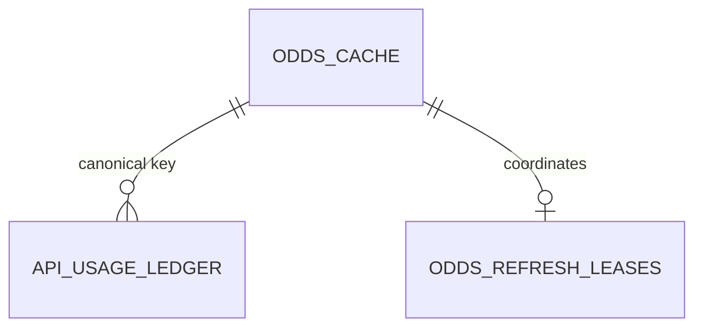
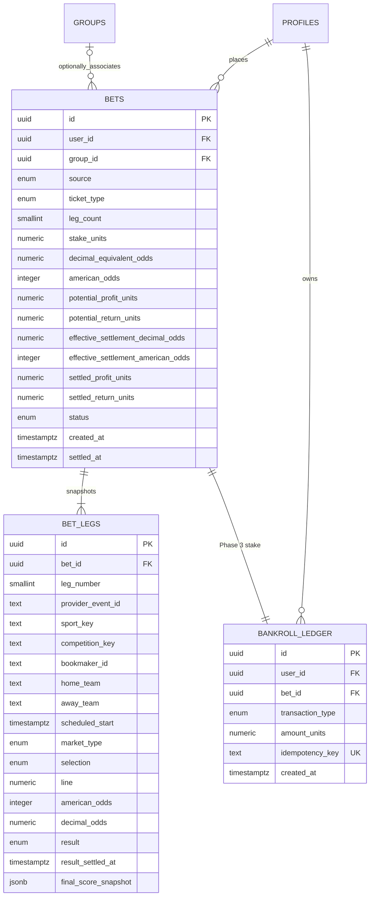
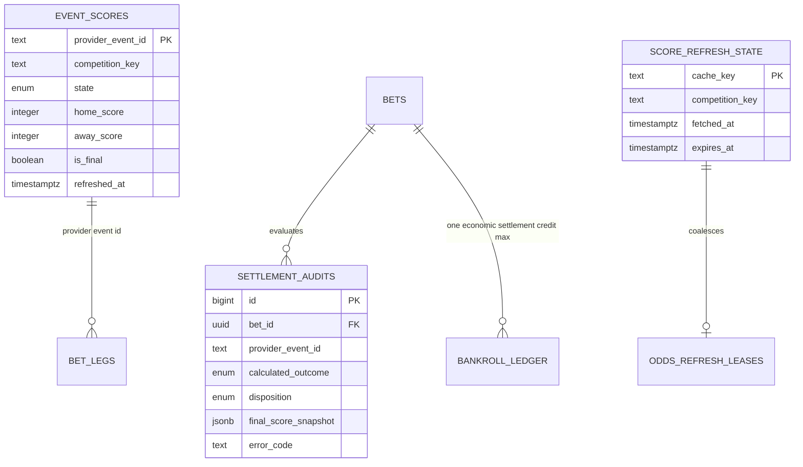
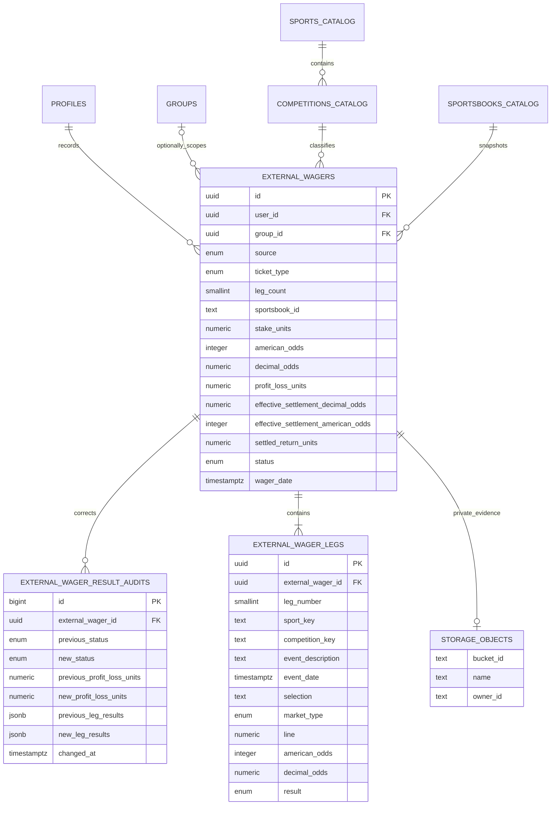
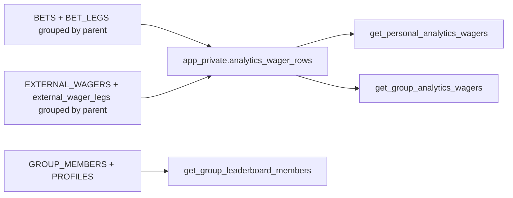
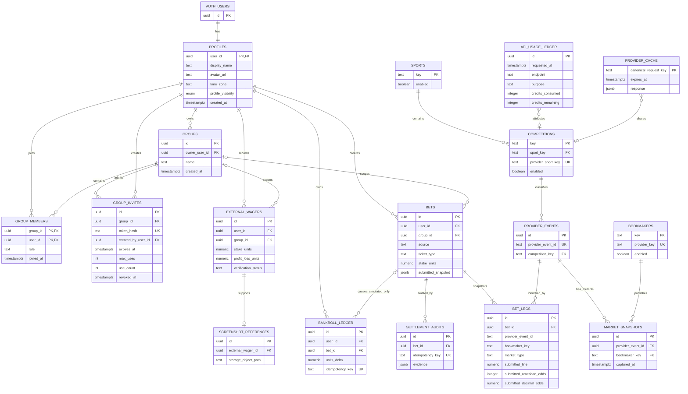

# Database Entity Relationship Design

## Phase 2 operational data

`public.odds_cache` stores one replaceable normalized dataset per canonical upstream request. `public.api_usage_ledger` stores only actual upstream requests. `app_private.odds_refresh_leases` coordinates refresh ownership across application instances and is not exposed to authenticated clients. These are operational provider records, not future immutable wager snapshots.

## Phase 3 durable wagering data

`public.bets`, `public.bet_legs`, and `public.bankroll_ledger` are durable system-of-record tables. Phase 7 uses the existing one-to-many relationship for both ticket types: straight tickets have one leg and parlays have two through twelve. Original accepted economics and effective settlement economics are both retained. Current balance is `sum(bankroll_ledger.amount_units)`; no separate mutable balance is authoritative.

## Phase 4 score and settlement data

Score data is operational and shared; final records used for settlement are protected from automatic replacement. Settlement audits and bankroll entries are durable append-only evidence. Accepted ticket and leg terms remain immutable.

## Phase 5 external wager and screenshot data

External wagers have no relationship to `BANKROLL_LEDGER`. Owner-only functions calculate results, while RLS permits owner reads and current-member reads for an explicitly group-associated record. Screenshot object authorization follows the same relationship at the storage layer.

## Phase 6 analytics read model

The canonical projection is a function, not a mutable table. Settlement and correction audit rows never enter it. Each parlay parent appears once, with `mixed` sport/competition dimensions when its legs differ. The personal RPC derives the caller and the group RPCs require current membership; browser roles cannot execute the unrestricted private projection. Exact application aggregation produces summaries, breakdowns, and leaderboard ranks from these authorized rows.

## Scope

This is the conceptual full-domain model required to confirm that the architecture can support multiple users and private groups. Phase 0 migrates only a locked server-only schema foundation. Phase 1 owns physical profile, group, membership, and Row Level Security definitions. Conceptual relationships must not be treated as implemented tables.

## Integrity and authorization boundaries

- Phases 1–6 physically implement the profile/group, provider, simulated wager, score/settlement, external-wager, and analytics systems shown above. Phase 7 extends the existing ticket/leg tables and adds normalized external legs; later social entities remain conceptual.
- `group_members` is a join table from its first implementation, so one user can belong to multiple groups without a schema rewrite.
- Group invite plaintext tokens are never stored. Redemption uses a hashed lookup, row lock, expiry, revocation state, and bounded usage count.
- The Phase 1 owner is immutable. Membership and invitation writes occur only through authorized functions; browser roles cannot write those tables directly.
- RLS will protect every exposed table. Ownership and group membership checks occur at the database boundary, including direct API access.
- `bets` and `bet_legs` retain immutable submitted terms. Mutable provider cache and market snapshots cannot rewrite a submitted ticket.
- Only simulated bets may reference bankroll ledger entries. External wagers use a distinct entity and never enter the virtual-bankroll path.
- Phase 3 ledger entries are append-only and use unique idempotency keys. Initial allocation is unique per user and stake debit is unique per bet. Unit values use two decimals, accepted decimal odds use four, and placement is serialized per user before the authoritative ledger sum is checked.
- Screenshot object paths reference the private Phase 5 bucket. Storage policies require the owner namespace for upload and owner/current-group-member authorization for attached-object reads.
- `bets.ticket_type` and `external_wagers.ticket_type` distinguish straight and parlay parents. Parlay leg counts are constrained to two through twelve; straight tickets remain one-leg records for historical compatibility.
- Simulated parlay settlement is service-role only and writes at most one `settlement:<bet_id>` economic credit. External parlay creation/result functions are caller-owned and never write the virtual ledger.

## Phase ownership

- Phase 1: profiles, groups, memberships, roles, invites, and RLS test harness.
- Phase 2: sports, competitions, bookmakers, provider events, market snapshots, provider cache, and API usage ledger.
- Phase 3: straight simulated bets, immutable leg snapshots, and bankroll stakes.
- Phase 4: normalized shared score state, refresh metadata, append-only settlement audits, and idempotent bankroll returns for straight wagers.
- Phase 5: external wagers and screenshot references.
- Phase 6: canonical analytics projection plus secured personal/group read functions and application aggregation.
- Phase 7: multi-leg simulated/external parlay rules, per-leg result state, effective settlement economics, and canonical analytics integration.
